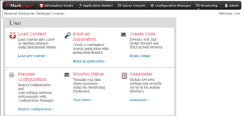
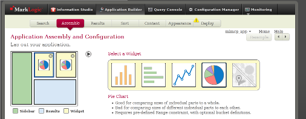
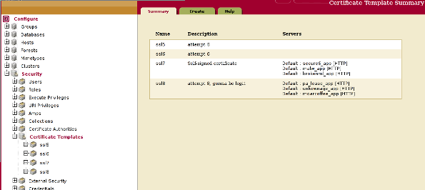
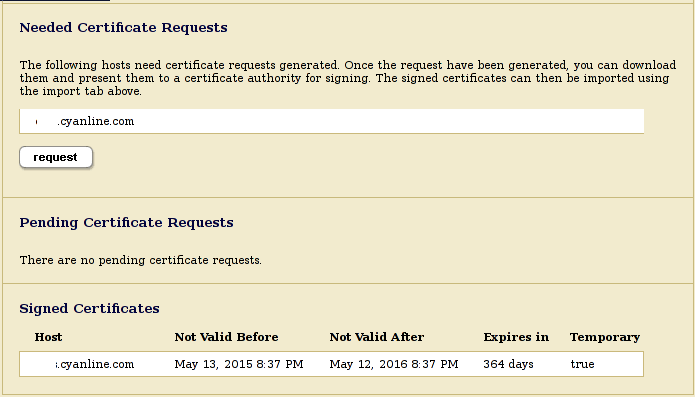
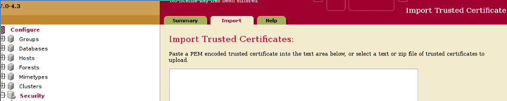
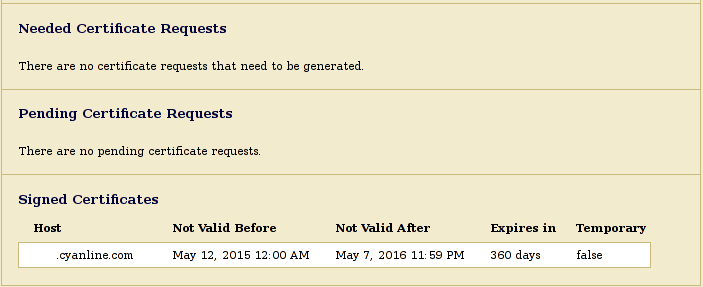

5.17.15
#MarkLogic Roxy App Deployment with SSL/HTTPS

##Overview
This document will cover the following.

1. [Pre build rest-app with wizard/InfoStudio](#build)
2. [Capture and configure the configuration files](#capture)
3. [Creating an SSL Template with a signed cert](#ssl)
4. [Deploying a Roxy app with a signed cert](#roxy-deploy)

##Method
For this document's example, we will build an app with the Information Studio on one machine, and then capture its configuration using Roxy from another machine. We will deploy our Roxy application to the second machine. The first machine will be our `dev` machine/environment, the second machine will be our `local` machine/environment.

###1.  Build

First, we used the Information Studio to build an app to our liking. Specifically, we created a DB, ingested data into the DB, configured the Range Indexes, created a REST app, and matched the facets to the range-indices.

Once the app is created, we use the Application Builder to tweak it. This consists of

* assembling the columns/layouts
* configuring the aesthetics of the Live Preview, Content, and the app's appearance. 
* deploying the REST App to a port such as 8010

###2. Configuration
Next, we used Roxy to perform a full capture of the previously built app. Roxy can be found on MarkLogic's [github page](https://github.com/marklogic/roxy Roxy@github). A great guide to Roxy capture can be found [here](http://grtjn.blogspot.nl/2014/10/capturing-marklogic-applications-with.html Capturing MarkLogic applications with Roxy)

The steps to complete this are as follows.
####2.1  Create an empty Roxy project 

`ml new cloudapp --server-version=7 --branch=dev --app-type=rest`

Where

* `ml new` is the command to create the app
* `cloudapp` is the name of this app
* `--server-version=7` sets the version of MarkLogic to use (Up to 8 now)
* `--branch=dev` out of the boxy Roxy, being a deployment framework, comes with 3 deployment environments: `dev, local, prod` (production)
* `--app-type=rest` tells Roxy we want an [REST App](https://developer.marklogic.com/learn/rest MarkLogic REST app descrip)

Here, we will have produced a directory called `cloudapp` with the Roxy app structure inside. Within the directory, there are many files of concern, but lets take them one at a time. 

####2.2 Capture the `dev` app configuration

We want to capture the configuration of the app built on the dev server in Information Studio. In order to do so, we need to tell this Roxy app where it will get the app configuration files from. Our Information Studio built app will be considered our `dev` environment, and the app we deploy with Roxy will initially be our `local` environment. 

Create and edit the file `deploy/dev.properties` and add the following.

    user=admin
    password=x
    dev-server=192.168.1.100

Where the credentials will be what we used to sign into the HTTP Basic Auth after creating the `dev` app. The server address is the address of the server on which we created the `dev` app.

Next, we perform the capture by executing the following command.

    ml dev capture --full-ml-config

If you're using git to monitor changes, you will see that a new file, a really long file, has been created. This file, `deploy/ml-config-dev.xml`, contains all of the details of the configuration of the MarkLogic server we created the `dev` server on.

Now that we have the full config, we can siphon out the details of our `dev` REST app from `ml-config-dev.xml` and use them for our local environment. This can be done 2 ways. The first is to hard code the configuration details found in `ml-config-dev.xml` into `ml-config.xml` , or we can set the configuration details from within an environment. 

We're went with a hybrid of those options. Details placed in `ml-config.xml` will not be configurable between environments (`dev/local/prod`). In our case, the actual REST Application's DB, Range Indices, and Modules will not change in setup, but only in name. Therefore, the following changes are the only changes made to `ml-config.xml`.

In the `assignments` tag, we added

    <assignment>
        <forest-name>cloudapp_db-1</forest-name>
    </assignment>
    <assignment>
        <forest-name>cloudapp_app-modules-1</forest-name>
    </assignment>

And, in the `databases` tag, we added the configuration of our DB.

    <database>
      <database-name>cloudapp_db</database-name>
      <forests>
	<forest-id>cloudapp_db-1</forest-id>
      </forests>
      <range-element-indexes>
	<range-element-index>
	  <scalar-type>dateTime</scalar-type>
	  <namespace-uri>http://marklogic.com/xdmp/dls</namespace-uri>
	  <localname>created replaced</localname>
	  <range-value-positions>false</range-value-positions>
	  <invalid-values>reject</invalid-values>
	</range-element-index>
	<range-element-index>
	  <scalar-type>unsignedLong</scalar-type>
	  <namespace-uri>http://marklogic.com/xdmp/dls</namespace-uri>
	  <localname>version-id</localname>
	  <range-value-positions>false</range-value-positions>
	  <invalid-values>reject</invalid-values>
	</range-element-index>
	<range-element-index>
	  <scalar-type>string</scalar-type>
	  <collation>http://marklogic.com/collation/</collation>
	  <localname>from</localname>
	  <range-value-positions>false</range-value-positions>
	  <invalid-values>reject</invalid-values>
	</range-element-index>
	<range-element-index>
	  <scalar-type>string</scalar-type>
	  <collation>http://marklogic.com/collation/</collation>
	  <localname>to</localname>
	  <range-value-positions>false</range-value-positions>
	  <invalid-values>reject</invalid-values>
	</range-element-index>
      </range-element-indexes>
    </database>
    <database>
      <database-name>cloudapp_app-modules</database-name>
      <schema-database>App-Services</schema-database>
      <forests>
	<forest-id>cloudapp_app-modules-1</forest-id>
      </forests>
      <directory-creation>automatic</directory-creation>
      <maintain-last-modified>true</maintain-last-modified>
    </database>

Upon editing these files, note that a lot of parameter's values are represented with something like `@ml.app-name`. *These are references.*

In other words, when Roxy moves to deploy an application in the said environment, it will use `ml-config.xml` to derive its values. For a hard coded value, the parameter's value is taken as is. For a parameter with a referenced value, Roxy will check the command's set environment, and use the corresponding properties file to set the param's values.

The next step will shed some light on the references. Next, create and edit the file `deploy/local.properties`, and add the following.

    user=admin
    password=x 

    role-name=admin

    app-name-user=admin
    appuser-password=x
    app-role=admin

    default-user=admin

    app-name=cloudapp
    app-port=8010

    xdbc-server=cloudapp_xdbc
    scc-port=8011

    content-db=cloudapp_db
    modules-db=cloudapp-modules

**Note:** the `local` environment is going to be created and thus the values set do not correspond to the `dev` server, but instead are *new* services (apps, dbs, forests, modules, etc).

Getting the configuration files right will be painful. We suggest `tail -f /var/opt/MarkLogic/Logs/ErrorLog.txt` when running the following Roxy commands. 

####2.3 Bootstrap
We're ready to bootstrap our `local` environment. Doing so will create a REST app on the port designated with `app-port` in our `local` properties file. Run the following command.

    ml local bootstrap

Where
* `ml local` tells Roxy which environment we're working with, and
* `bootstrap` tells roxy to to configure the application to the `local` environment

Again, watch the log to see what Roxy is tripping on. Continue to massage the `ml-config.xml` and `local.properties` files until the bootstrap command returns successfully. You can browse to the app's port and the MarkLogic Admin interface to verify your app and services were created. 

####2.4 Deploy Modules
Assuming that you have got the `... Bootstrap Complete` result, we can now move onto the second half of capturing. Here, we will capture the Modules, which is the source code for the REST App built on the `dev` machine. Run the following command.

    ml dev capture --app-builder=orig_cloudapp

Where

* `orig_cloudapp` is the name of the app we built using Information Studio.

Again, if you're using version control you'll notice that the was-empty `src/` directory is now populated with our application's source code, as well as a few more XML configuration files in `rest-api/`.

Finally, we're ready to try and deploy the captured app to our `local` environment. Execute the following command to do so.

    ml local deploy modules

If all goes well, the fully captured app will be fully deployed at the specified port. If the deploy does not go successfully, back to `/var/opt/MarkLogic/Logs/ErrorLog.txt` and tweaking of the `ml-config.xml` and `local.properties` files. Note, another file of concern will be `rest-api/config/options/all.xml`.

#####Helpful Hints
The Roxy tool supports ingesting data into the specified DB. It is simple to execute. **Be warned, the following command can produce different results than an ingestion via the Information Studio.**

To populate the DB, execute the following.

    ml local deploy content

Where

* `deploy content` will upload the contents of the `data/` directory (must create this dir) into the DB

Also note, this is where the xcc/xdbc server come into play, these need to be created for the ingestion process to work.

To undo Roxy commands, use 
* `ml local clean modules` and
* `ml local wipe`

And, to restart the MarkLogic server
* `service MarkLogic restart`

###3.  Create SSL Template
Next, we will use the admin interface to create a signed cert SSL Template. This will consist of producing a cert request (.csr), importing our CA's root trust certs into Marklogic, and deploying a Roxy app that will use the template.

Currently, MarkLogic does not support importation of an already issues cert, instead we must generate a cert request (.csr) using MarkLogic and then take that to a CA.

####3.1 Create
The trick here is this, if the configuration files are not just right, the rest app that will be deployed will re-create the SSL Template...in other words, overwrite/obliterate the template that we created in the admin interface. Which, if the template contained a signed cert, means we're going all the way back to the CA with a newly generated csr to ask to be re-issued our just-issued cert. 

Below are a few helpful pieces of information regarding the templates.

* [ML SSL Template Dev Guide](https://github.com/marklogic/roxy/wiki/Security#using-an-existing-template)
* [Roxy SSL Template Guide](https://docs.marklogic.com/guide/admin/SSL)
* [Creating (signed cert) SSL Template w/o CSR (request)](https://github.com/marklogic/roxy/issues/435)

The developer guide for creating a template is very straight forward. Navigate to Certificate Templates, hit the `Create` button, give a name, descrip, and the certificate request information.

Next, click the `Status` button and notice the emptiness of "Needed Certificate Requests", "Pending Certificate Requests", and "Signed Certificates". 

####3.2 Request
To populate these sections, head over to the `Groups/Default/App Servers/` and server and select an arbitrary HTTP server to configure (temporarily). Head towards the bottom of its long configuration page to the ssl certificate section. Simply select the SSL Certificate Template we just created from the drop down menu, and select `ok`.

Navigate back to the Certificate Templates interface, and select the template we just created. Notice that now, we have populated some information. This is done because once the template is being used by an HTTP app server, the MarkLogic server creates a self signed cert and assigns it to the app server. 

Notice the `true` value for Temporary.

####3.3 ImportS
For no specific reason other that $$ , we went with Comodo as our CA. Looking through `Security/Certificate Authorities/` we see there is not Comodo support out of the box. Being that we can get a domain-valid cert from Comodo for $7, we decided to import Comodo's CA info into the MarkLogic server. If the deal is still going, it can be [found here](http://www.google.com/aclk?sa=l&ai=Cg8zWAbdTVdAO172EBLHggHjk1878Boz-58HcAerH4LlDCAMQAWDJxuWKtKTYD6ABvKTb1APIAQGqBCdP0PKNi68fAZmMrZ0kLcCSzLdT8mRyb9HSUBxB39dTwcGsRD2dvseAB6zbpCuIBwGQBwKoB6a-G9gHAQ&sig=AOD64_3QJdV_oeXrgZkdAGRuXjt97PpE6w&rct=j&q=&ved=0CIcBENEM&adurl=https://comodosslstore.com/promoads/cheap-comodo-ssl.aspx PositiveSSL $6.99). 

#####Certificate Authorities
Chain the trust/root CA keys into one file, and either paste the file or upload it at the Import interface, as shown below. Upon success, MarkLogic will now support Comodo signed certs. 

#####Signed Certificate
Now, we have a self-signed SSL Template and the ability for MarkLogic to support our coming CA-signed certificate. Time to get the certificate. Navigate to the SSL Template configuration interface, and hit the `Request` button.

Back at the Status page, things have changed. We no longer have Needed Certificates Requests, but instead have Pending Certificate Requests, with an accompanying `download` button. Download the .csr file, and head on over to your CA to request a signed certificate. After entering all of the required information, its time to provide the CA with our MarkLogic generated csr key. Once this process is complete, we will have a signed cert from a CA.

Notice now, that Needed and Pending are empty. Even more important, notice the Temporary value has changed from `true` to `false`.

Finally, we're ready to deploy our CA-signed SSL-enabled REST app using Roxy.

###4.  Deploy
Back in our Roxy's REST app directory, we need to edit `ml-config.xml` and our environment's properties file, `local.properties`.

Add the following to `ml-config.xml` under the `<groups><group><http-server>` tags.

    <ssl-certificate-template>@ml.ssl-certificate-template</ssl-certificate-template> 
    <ssl-hostname>@ml.ssl-hostname</ssl-hostname> 

And the corresponding params/values in the `local.properties` file.

    ssl-certificate-template=cloudapp_sslplate
    ssl-hostname=s.cyanline.com

The trick to not overwriting your template is to
* only have the `ssl-certificate-template` param in the properties file (and not country, province, etc), and
* **remove the `<certificates>` tag from `ml-config.xml` in its entirety.**

So, ditch this

    <certificates xmlns="http://marklogic.com/xdmp/pki">
        <certificate>
            <name>@ml.ssl-certificate-template</name>
            <countryName>@ml.ssl-certificate-countryName</countryName>
            <stateOrProvinceName>@ml.ssl-certificate-stateOrProvinceName</stateOrProvinceName>
            <localityName>@ml.ssl-certificate-localityName</localityName>
            <organizationName>@ml.ssl-certificate-organizationName</organizationName>
            <organizationalUnitName>@ml.ssl-certificate-organizationalUnitName</organizationalUnitName>
            <emailAddress>@ml.ssl-certificate-emailAddress</emailAddress>
        </certificate>
    </certificates>

That should be enough assuming that we have successfully imported the Comodo trust chain into the Certificate Authorities, successfully created an SSL Template with a CA signed cert, and configured the configuration files correctly.

    ml local bootstrap

Whether or not the modules are currently deployed, we can still navigate to our app's port using `https://` and click the padlock to see more information about the signed cert. The CA signed cert will not force the user to click past the warning and will have information about the Certificate Authority.

#####Helpful Hints
We will be sending our users to the REST app after they have already been authenticated on another server, and will authenticate them with LDAP once they reach the REST app. But, we do not want to have them re-enter their password at the REST app, so including this in `local.properties` will remove the HTTP Basic password pop-up.

    authentication-method=application-level

##Conclusion
In conclusion, we have created an app with the wizard, captured that app's configuration using Roxy, deployed a copy of the application with Roxy, and deployed the app to use an existing SSL Template. 

At this point, we would love to hear if anyone who has reached this point has been able to successfully run `ml local deploy modules` while the SSL Template is configured. This command has hung indefinitely for us while SSL is configured, self-signed or CA-signed. 

Finally, we will be debugging the Roxy program to see what about our SSL configuration is tripping the ruby script up. 

***
@cyanline | 2015 | All Rights Reserved
